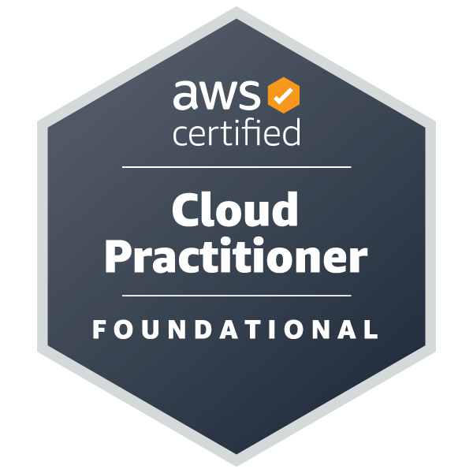

## Hi there 👋
はじめまして！ 
東京 で Webエンジニア として働いています。

---

### 👩‍💻 私が使っている技術 (Tech Stack)

* **Languages:** [JavaScript, PHP, etc.]
* **Frontend:** [Vue]
* **Backend:** [Laravel]
* **Cloud:** **AWS**, [AWS SSA学習中]
* **Database:** [MySQL]
* **Tools:** [Git, Docker, etc.]

### 🛡️ 認定資格 (Certifications)

### 🌱 現在学習中・取り組んでいること

### 📫 連絡先 (Connect with me)

* **Zenn / Qiita:** []

---